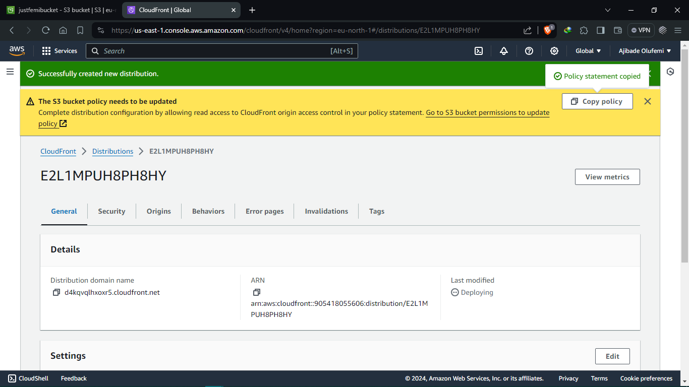

# aws-task-1

## details of assignment

### My Solution

#### 1. Create an AWS account

#### 2. Search for s3 and choose "Create bucket" to create s3 bucket.

#### 3. Give bucket a unique name, leave every other settings as default and upload.
<!-- add image -->

#### 4. Upload objects (static website files) to the bucket created above

#### 5. Search for cloudfront

#### 6. Then create a distribution

#### 7. Setup the distribution as follows:

#### 8. Copy the policy by clicking the "Copy policy" button

#### 9. Go to the permission of the s3 bucket

#### 10. Edit the bucket policy

#### 11. Paste the policy and click on "save changes"

#### 12. Go back to the cloudfront distribution and copy the domain name generated.

Static website hosted succesffully
